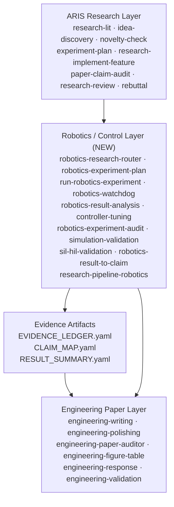
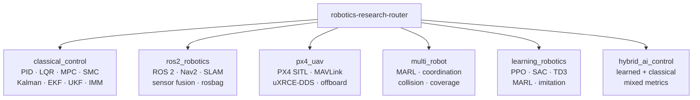
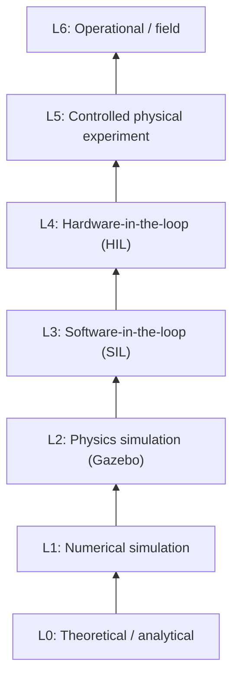

# Architecture

## Overview

ARIS Engineering Robotics is a three-layer integration system.



---

## Layer Responsibilities

### ARIS Research Layer

Primary source: `Auto-claude-code-research-in-sleep`

| Responsibility | Skill |
|---|---|
| Literature search | `research-lit` |
| Idea discovery | `idea-discovery`, `idea-discovery-robot` |
| Novelty assessment | `novelty-check` |
| Experiment planning (general) | `experiment-plan` |
| Implementation | `research-implement-feature` |
| Results analysis (general) | `analyze-results` |
| Ablation design | `ablation-planner` |
| Claim-evidence audit | `paper-claim-audit` |
| Peer-review of own paper | `research-review` |
| Reviewer response | `rebuttal` |
| Claim drafting | `claims-drafting` |

### Robotics / Control Layer

Primary source: this repository

| Responsibility | Skill |
|---|---|
| Profile detection and routing | `robotics-research-router` |
| Robotics experiment design | `robotics-experiment-plan` |
| Experiment execution | `run-robotics-experiment` |
| Experiment health monitoring | `robotics-watchdog` |
| Result analysis | `robotics-result-analysis` |
| Controller parameter tuning | `controller-tuning` |
| Experiment integrity audit | `robotics-experiment-audit` |
| Simulation validity | `simulation-validation` |
| SIL/HIL evidence classification | `sil-hil-validation` |
| Result → claim generation | `robotics-result-to-claim` |
| Full pipeline orchestration | `research-pipeline-robotics` |

### Engineering Paper Layer

Primary source: `engineering-paper-skills`

| Responsibility | Skill |
|---|---|
| Manuscript writing | `engineering-writing` |
| Language polishing | `engineering-polishing` |
| Full paper audit | `engineering-paper-auditor` |
| Figure/table generation + tracing | `engineering-figure-table` |
| Reviewer response | `engineering-response` |
| Submission validation | `engineering-validation` |
| Task routing | `engineering-paper-router` |

---

## Evidence Flow

```mermaid
flowchart LR
    R["Raw result files\n(CSV, rosbag, log)"]
    RA["robotics-result-analysis"]
    EA["robotics-experiment-audit"]
    RC["robotics-result-to-claim"]
    EL["EVIDENCE_LEDGER.yaml"]
    CM["CLAIM_MAP.yaml"]
    PA["engineering-paper-auditor"]
    EW["engineering-writing"]
    FT["engineering-figure-table"]
    EP["engineering-polishing"]
    EV["engineering-validation"]

    R --> RA --> EA --> RC --> EL --> CM
    CM --> PA --> EW --> FT --> EP --> EV
```



---

## Profiles

Research profiles activate the correct metric sets, watchdog checks, and
experiment templates.



---

## Evidence Level Hierarchy



Claims may not exceed the level of evidence produced.

---

## Upstream Reference Strategy

Skills from ARIS and EPS are **referenced, not vendored**.

```
aris-engineering-robotics/         ← this repo
    tools/install_skills.sh        ← copies or symlinks upstream skills
    .aris-engineering-robotics/
        config.yaml                ← configurable upstream paths
        installed-skills.txt       ← manifest of what was installed
```

No upstream repository is modified.
